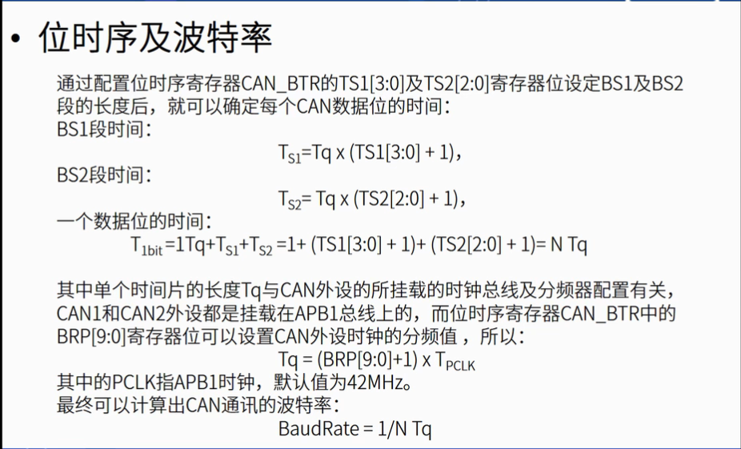
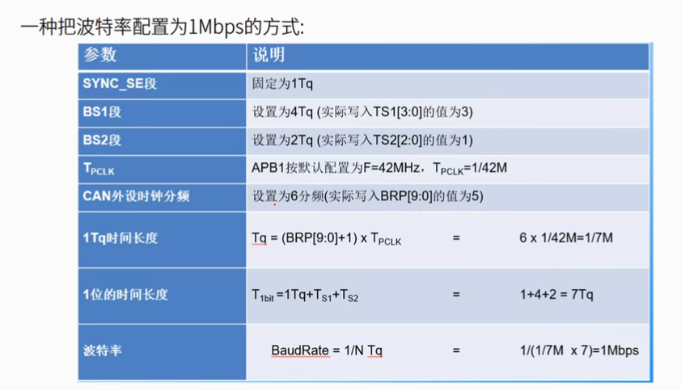

# CAN通信——电机控制
一种常用的无刷伺服电机控制（通信）方法  
控制器局域网络(Controller Area Network),BOSCH公司开发，成为国际标准ISO11519，工业控制局域网的标准总线

异步通讯，半双工，两条差分信号线
1. 抗干扰，共模噪声完全抵消
2. 抗电磁干扰，同理
3. 时序定位精准
逻辑1（隐形电平）两线均2.5V，逻辑0（显性电平）H:3.5V L:1.5V 单根总线线与特性

## CAN通信的基本原理

物理层形式
1. 闭环总线 40m 1Mbps 线端两个120ou电阻构成闭环
2. 开环总线 1km 125kbps 两根独立总线 每根2.2kou电阻

协议层：
1. 异步通讯，约定波特率进行通信，约定方式为Tq及每位数据占据的Tq个数 =>每一位的长度
2. 用“位同步”抗干扰和吸收误差，保证每一位采样正确
   
   位同步方法：
   1. 硬同步：检测下降沿是否位于SS采样段处，否，则强行移动至下降沿处
   2. 重新同步：在数据位间，由于时钟等因素，采样信号和总线信号出现了偏移，采用主动增加或缩减PBS1和PBS2的方式，使下一位采样信号回到原位置，这一增加或缩减的长度称为重新同步补偿宽度SJW(reSynchronization Jump Width)，SJW可以限制最大值，当极限值较大时，通讯速率会下降

数据传输方法：
在同一数据线上传输不同信息（对象、命令读/写、数据）的方法：打包为报文。

在原始数据段的前面加上传输起始标签、片选(识别)标签和控制标签，在数据的尾段加上 CRC 校验标签、应答标签和传输结束标签，把这些内容按特定的格式打包好，就可以用一个通道表达各种信号了，当整个数据包被传输到其它设备时，只要这些设备按格式去解读，就能还原出原始数据，这样的报文就被称为 CAN 的“数据帧”。除了数据帧，还有四种不同的*指令帧和通信帧*（这两个名字是我起的）。

仲裁段：ID信息，决定谁先发送（线与），先出现隐性电平（逻辑1）优先级低，分标准与扩展两种格式，标准格式（11位，高权重位先行）优先级更高

数据帧：0~8个字节

其他帧格式详见书

## STM32CAN的一些特点
1. 支持CAN2.0A\B, H7支持FDCAN
2. 不支持DMA
3. CAN1是主设备，CAN2无法独立访问“存储访问控制器”，必须使能CAN1时钟

发送过程，程序员将需要需要发送的内容，包括 ID，数据长度码，数据等，按照一定的格式写入到消息 RAM 的地址中，发送管理单元从消息RAM 的地址中读取，交给 CAN控制内核，由控制内核完成发送过程。

接受过程，CAN 接受到数据时，根据验收筛选器的配置，对消息进行筛选，如果 ID匹配的话，则将消息存放到相应的消息 RAM 中。

## CAN常用功能设置
1. 主控制寄存器
   1. 调试冻结功能
   2. 复位
   3. TTCM
   4. 自动唤醒
   5. 自动重传
   6. 锁定FIFO
   7. 发送优先级：顺序/ID
   8. 等
2. 位时序寄存器BTR
   1. 测试模式共有四种：正常、静默、回环、回环静默，有两位可用于选择模式
   2. SJW
   3. TS2
   4. TS1
   
3. 数据接收FIFO
   1. 2FIFO*3邮箱=6接收报文
   2. 可查询计数器值得到已存储个数
4. 验收筛选器
   1. ID长度可调整
   2. 两种模式：标识符列表/掩码模式（关键某几位）
## CAN初始化参数

## CAN的配置方法实操
1. 首先是例行的基本配置：
   1. RCC->HSE  ->Crystal/Ceramic Resonator
   2. SYS->Debug->Serial Wire
2. 接下来配置CAN控制器参数  
   用到哪个CAN控制器x就是几，注意选用从控制器时，主控制器也要使能
    1. CANx->activate
       - 这里需要注意下引脚：大疆的C板上有两个CAN1输出，引脚为PD0\PD1,而STM32的CAN可选引脚有多条，因此在CubeMX配置中需要特别注意
    2. 设置CAN控制器参数（总线时钟为168M情况下，速率为1Mbps） %暂时还没弄懂
       - 预分频器Prescaler = 3
       - TBS1 = 10t
       - TBS2 = 3t
    3. 视频中介绍的方案为：
      
    1. 使能接收中断
1. 最后将上层驱动文件移植到自己的工程当中
   1. 将文件包复制到自己的工程路径下
   2. 将src即.c文件添加到项目树当中
   3. 将.h文件添加到IncludePath当中
   4. 添加预编译指令、初始化命令、主函数调用发送程序
2. 编译下试试吧