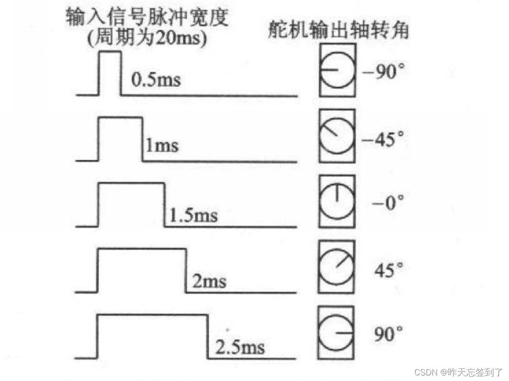

# 高级定时器——常见舵机控制

此处常见电机特指MG996R/MG90s及同类型控制方法的舵机
配置流程

1. 基本设置
    * RCC外部晶振
    * SYS外部下载
2. 定时器设置

若想看到明显的现象，必须要有延迟时间

应用扩展

1. 非360度舵机控制
    1. 控制原理
        舵机的控制一般需要一个20ms左右的时基（周期）脉冲，该脉冲的高电平部分一般为0.5ms-2.5ms范围内的角度控制脉冲部分，总间隔为2ms。以180度角度伺服为例，那么对应的控制关系是这样的：
        舵机的控制，需要一个20ms的时基脉冲，控制高电平时间为0.5ms~2.5ms范围内即可控制舵机在0 ~ 180°转动。
        t=0.5ms---------------舵机转动到0°  
        t=1.0ms---------------舵机转动到45°  
        t=1.5ms---------------舵机转动到90°  
        t=2.0ms---------------舵机转动到135°  
        t=2.5ms---------------舵机转动到180 
        
    2. 配置方法
        只需要将对应的CHANNEL模式设置为PWM输出即可
        此时产生PWM波形频率：72M / 719预分频+1 = 100HZ 实际输入到定时器的频率是多少？分频时间要如何计算？
        看挂载在哪根总线下的timerclock，84/84= 1MHZ，period= 20000
        20000*2.5/20 = 2500 //最大占空比
        20000*0.5/20 = 500  //最小占空比
        波形周期：1  / 50(f) = 20ms
        初始占空比为：0%  即选项中的Pluse
        初始极性：即在Pluse时间内电平是高还是低
    3. 在使用STM32CubeIDE配置PWM生成代码后，我们只需要用下面方法就可以
        * 启动PWM输出：  
          HAL_TIM_PWM_Start(&htim4,TIM_CHANNEL_1);
        * 如果想要停止PWM信号输出可以使用下面方法：  
          HAL_TIM_PWM_Stop_IT(TIM_HandleTypeDef *htim, uint32_t Channel);
        * 如果想要在程序中动态的修改Pulse来调节占空比可以使用下面方法：  
          __HAL_TIM_SET_COMPARE(__HANDLE__, __CHANNEL__, __COMPARE__) 
